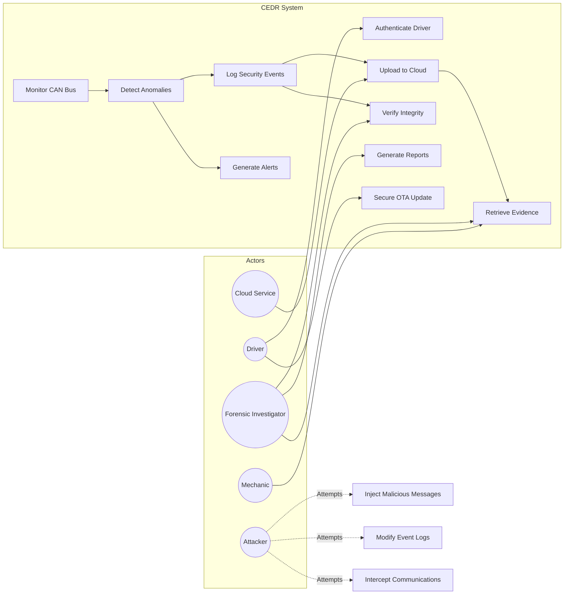
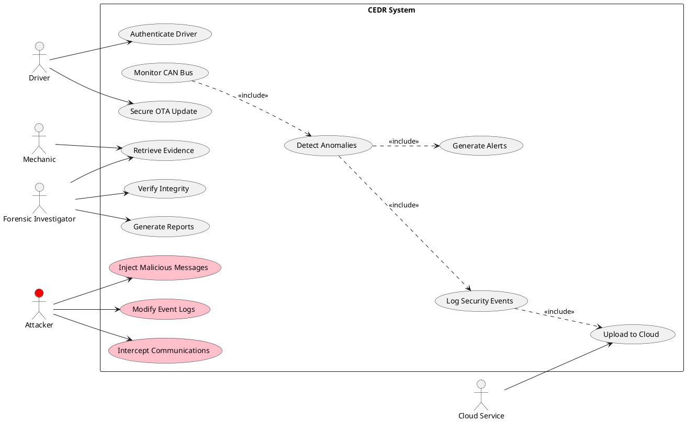
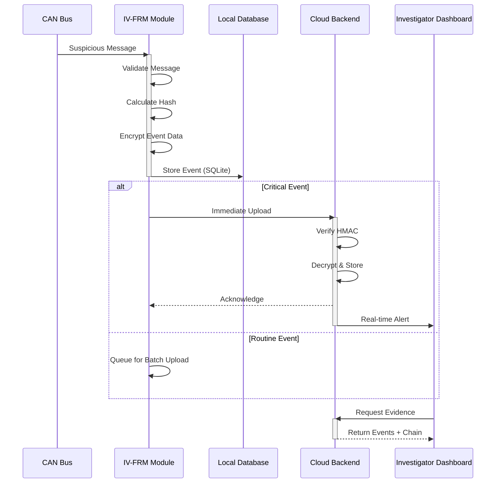
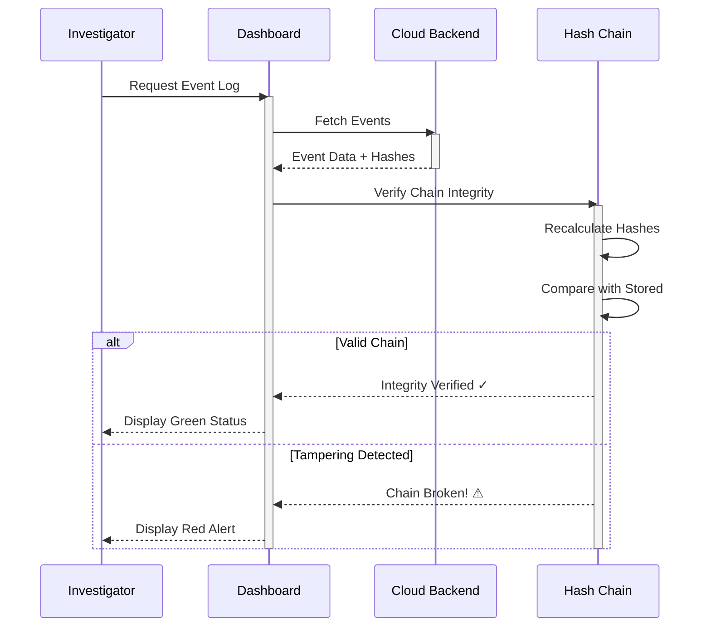
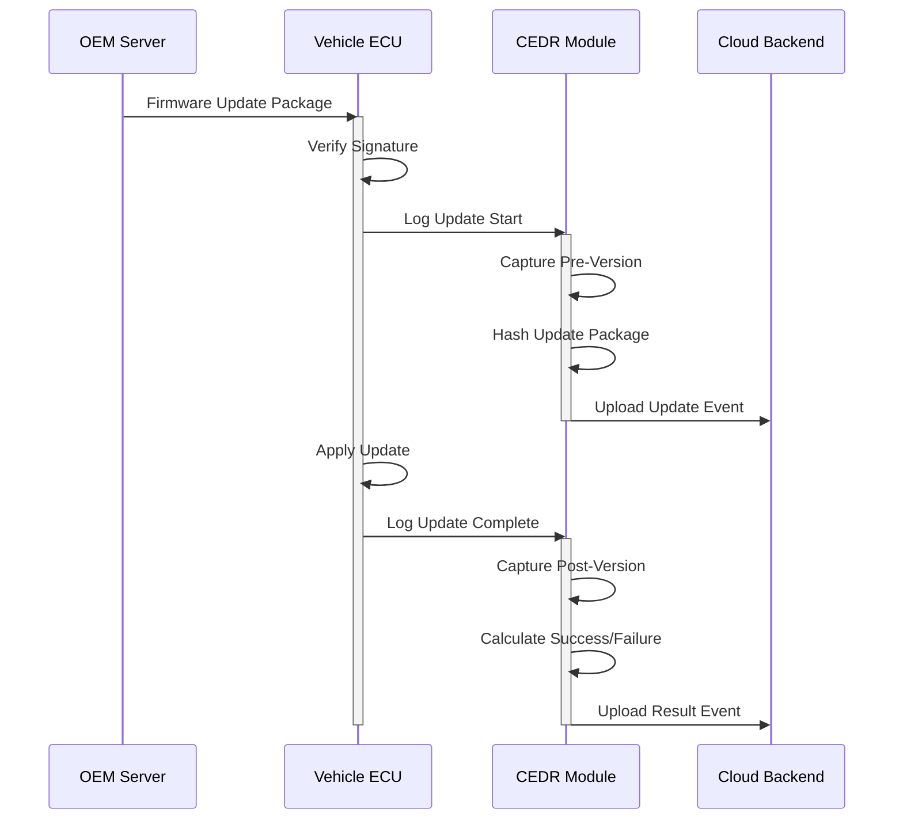
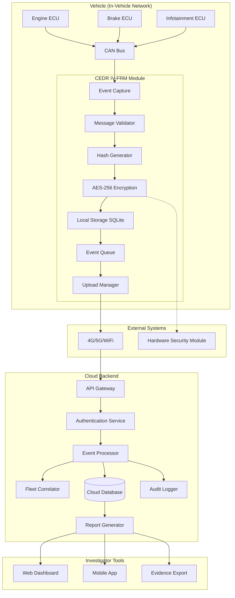
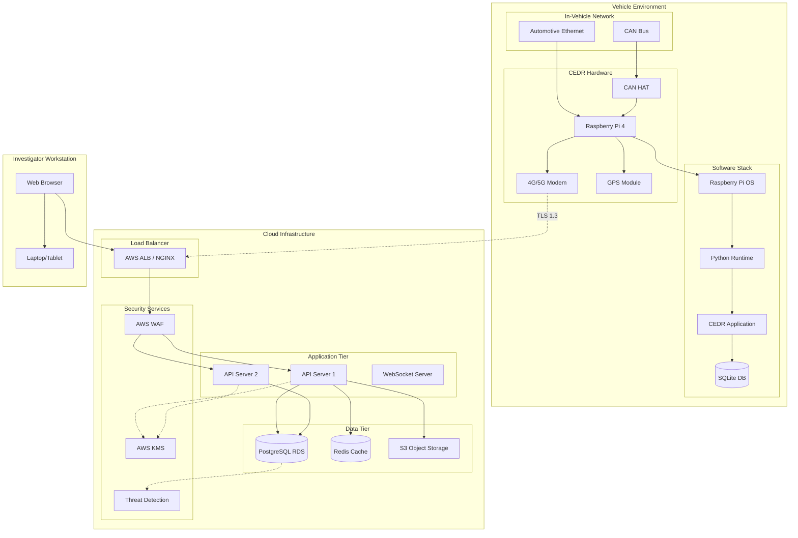
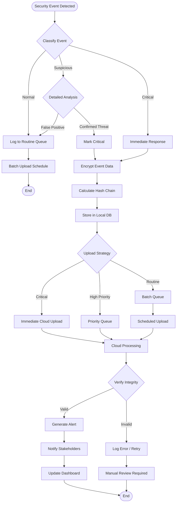
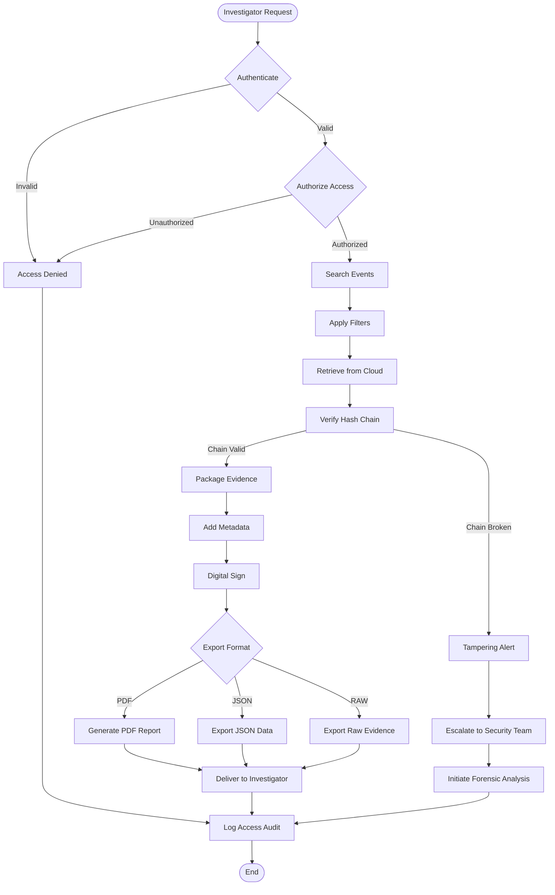
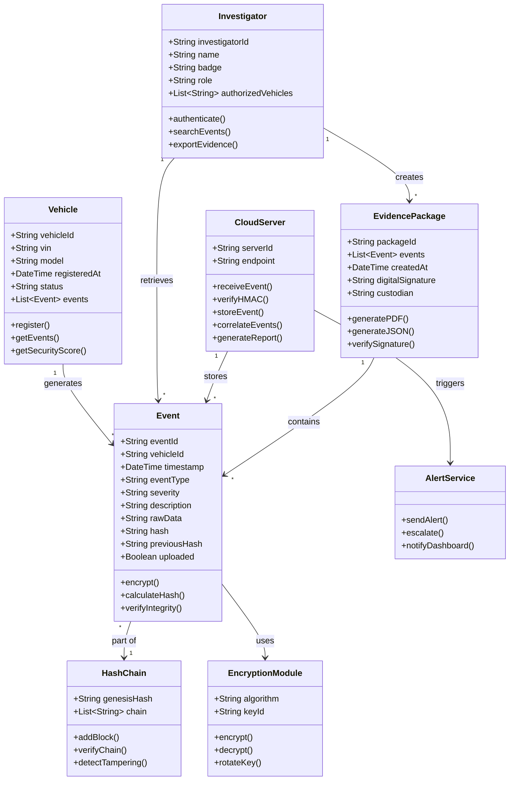

# CEDR UML Diagrams
## Cybersecurity Event Data Recorder (IV-FRM)
### Team Cyber-Torque | CYB408 Capstone

---

## Table of Contents
1. [Use Case Diagram](#1-use-case-diagram)
2. [Sequence Diagrams](#2-sequence-diagrams)
3. [Component Diagram](#3-component-diagram)
4. [Deployment Diagram](#4-deployment-diagram)
5. [Activity Diagram](#5-activity-diagram)
6. [Class Diagram](#6-class-diagram)

---

## 1. Use Case Diagram

### Mermaid Version


### PlantUML Version


---

## 2. Sequence Diagrams

### 2.1 Security Event Detection & Logging



### 2.2 Tamper Evidence Verification



### 2.3 Secure OTA Update Logging



---

## 3. Component Diagram



---

## 4. Deployment Diagram



---

## 5. Activity Diagram

### 5.1 Incident Detection & Response Flow



### 5.2 Evidence Retrieval & Verification



---

## 6. Class Diagram



---

## PlantUML Source Files

### How to Render

**Option 1: Online Renderer**
- Copy PlantUML code to: https://www.plantuml.com/plantuml

**Option 2: VS Code Extension**
- Install "PlantUML" extension
- Preview diagrams directly in editor

**Option 3: Command Line**
```bash
# Install PlantUML
sudo apt install plantuml

# Generate PNG
plantuml CEDR_UML_Diagrams.puml

# Generate SVG
plantuml -tsvg CEDR_UML_Diagrams.puml
```

---

## Diagram Summary

| Diagram Type | Purpose | Key Elements |
|--------------|---------|--------------|
| **Use Case** | Actor-system interactions | Driver, Investigator, Attacker, 10 use cases |
| **Sequence** | Message flow over time | Event logging, tamper verification, OTA updates |
| **Component** | System structure | IV-FRM, Cloud, Dashboard, 15 components |
| **Deployment** | Physical infrastructure | Vehicle, AWS Cloud, Investigator workstation |
| **Activity** | Business process flow | Incident response, evidence retrieval |
| **Class** | Data model relationships | Event, Vehicle, Investigator, 7 classes |

---

## Compliance Mapping

| UML Diagram | ISO/SAE 21434 Work Product | Purpose |
|-------------|---------------------------|---------|
| Use Case Diagram | WP-08-01: Cybersecurity Requirements | Functional + security requirements |
| Sequence Diagram | WP-10-01: Security Controls | Control implementation flow |
| Component Diagram | WP-12-01: Architecture Design | System architecture documentation |
| Deployment Diagram | WP-13-01: Integration & Verification | Production deployment model |
| Activity Diagram | WP-14-01: Cybersecurity Operations | Incident response procedures |
| Class Diagram | WP-09-01: Design Specification | Data model for forensics |

---

*Document Version: 1.0*  
*Last Updated: April 9, 2026*  
*Team: Cyber-Torque*
